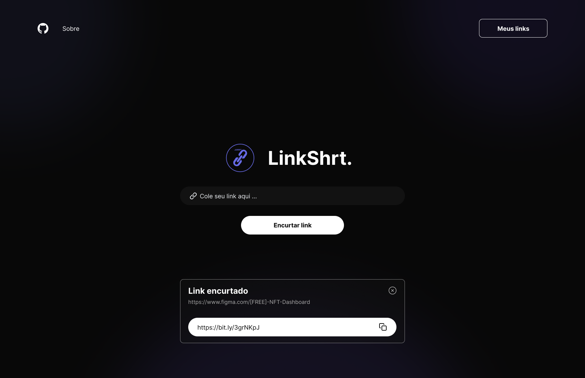
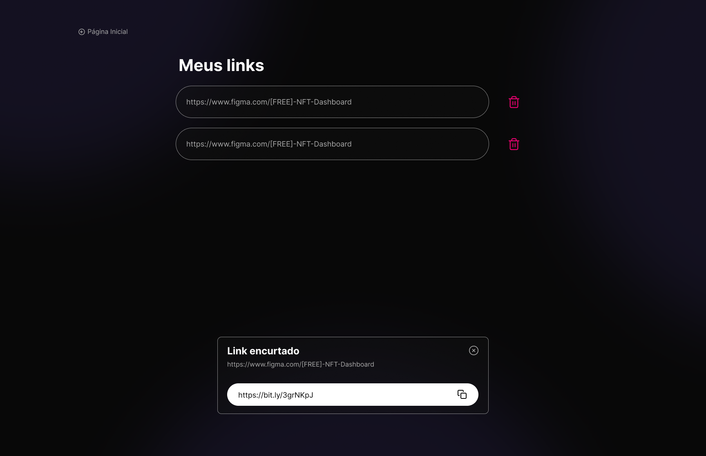
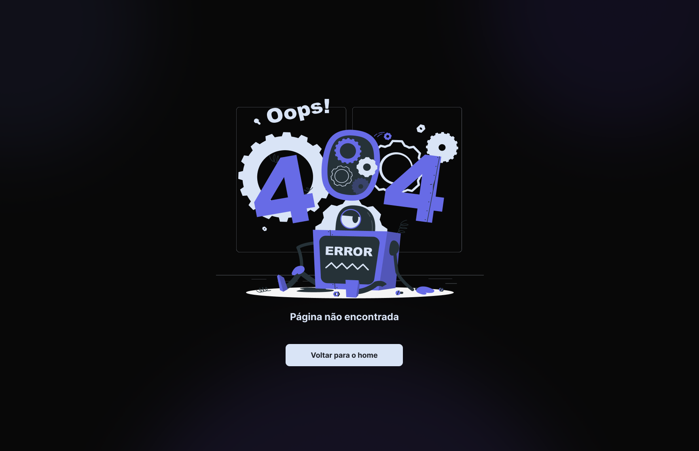

## Sobre o projeto

LinkShrt. é um encurtador de link que interage com a api oficial do [bitly](https://dev.bitly.com/).

Esse projeto foi desenvolvido durante a semana React JS, promovida pelo canal do [Sujeito Programador](https://www.youtube.com/c/Sujeitoprogramador), mas com o design  modificado por mim.

## Screenshots

[Demo]()

## Getting Started 
- clone this repository
    
    `git clone https://github.com/naiandersonb/link-shortener.git`

- In the project directory, you can run:

    `npm start`

## 👽 about me:
- Instagram - [@naiandersonbruno_](https://www.instagram.com/naiandersonbruno_/)
- Linkedin - [Naianderson Bruno](www.linkedin.com/in/naianderson-bruno-franca)
